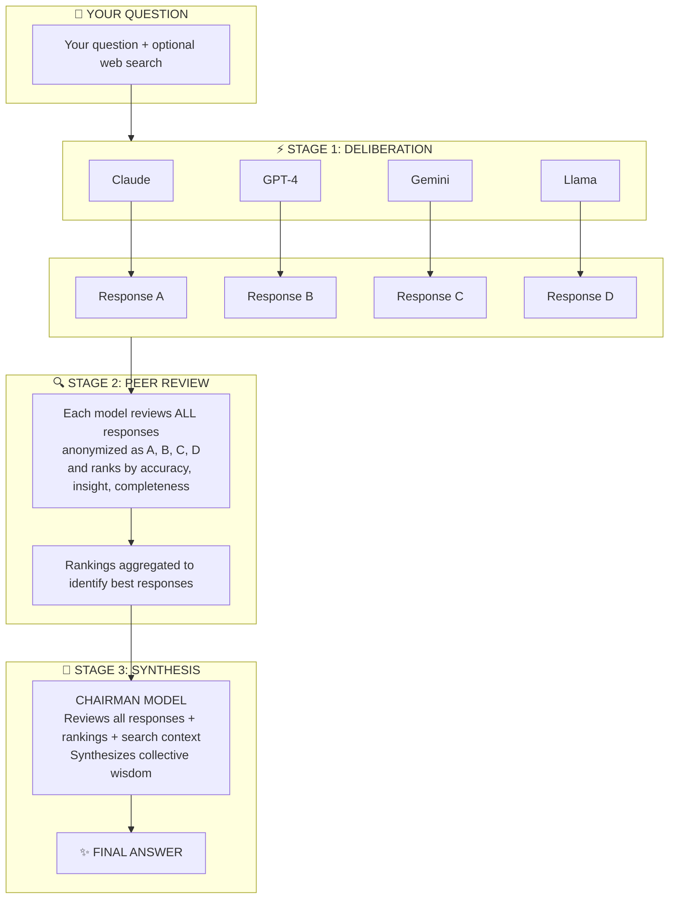

# LLM Council Plus


> **Collective AI Intelligence** — Instead of asking one LLM, convene a council of AI models that deliberate, peer-review, and synthesize the best answer.

[](https://www.python.org/downloads/)
[](https://reactjs.org/)
[](https://fastapi.tiangolo.com/)
[](https://opensource.org/licenses/MIT)

---

## What is LLM Council Plus?

Instead of asking a single LLM (like ChatGPT or Claude) for an answer, **LLM Council Plus** assembles a council of multiple AI models that:

1. **Independently answer** your question (Stage 1)
2. **Anonymously peer-review** each other's responses (Stage 2)
3. **Synthesize a final answer** through a Chairman model (Stage 3)

The result? More balanced, accurate, and thoroughly vetted responses that leverage the collective intelligence of multiple AI models.

<p align="center">
  <div align="center">
    <a href="https://www.youtube.com/watch?v=HOdyIyccOCE" target="_blank">
      
    </a>
    <a href="https://www.youtube.com/watch?v=NUmQFGAwD3g" target="_blank">
      
    </a>
  </div>
</p>

---

## Installation

```bash
git clone https://github.com/patrickgamer/llm-council-plus.git
cd llm-council-plus
./start.sh
```

That's it. The start script automatically installs all dependencies (Homebrew, uv, Node.js) if needed.

Then open **http://localhost:5173** and configure your API keys in Settings.

> **Note:** On Linux, you'll need to install Node.js manually if not present.

---

## How It Works



---

## Features

### Multi-Provider Support
Mix and match models from different sources in your council:

| Provider | Type | Description |
|----------|------|-------------|
| **OpenRouter** | Cloud | 100+ models via single API (GPT-4, Claude, Gemini, Mistral, etc.) |
| **Ollama** | Local | Run open-source models locally (Llama, Mistral, Phi, etc.) |
| **Groq** | Cloud | Ultra-fast inference for Llama and Mixtral models |
| **OpenAI Direct** | Cloud | Direct connection to OpenAI API |
| **Anthropic Direct** | Cloud | Direct connection to Anthropic API |
| **Google Direct** | Cloud | Direct connection to Google AI API |
| **Mistral Direct** | Cloud | Direct connection to Mistral API |
| **DeepSeek Direct** | Cloud | Direct connection to DeepSeek API |
| **Custom Endpoint** | Any | Connect to any OpenAI-compatible API (Together AI, Fireworks, vLLM, LM Studio, GitHub Models, etc.) |

<p align="center">
  
</p>

### Execution Modes

<p align="center">
  
</p>

Choose how deeply the council deliberates:

| Mode | Stages | Best For |
|------|--------|----------|
| **Chat Only** | Stage 1 only | Quick responses, comparing model outputs |
| **Chat + Ranking** | Stages 1 & 2 | See how models rank each other |
| **Full Deliberation** | All 3 stages | Complete council synthesis (default) |

### Web Search Integration

<p align="center">
  
</p>

Ground your council's responses in real-time information:

| Provider | Type | Notes |
|----------|------|-------|
| **DuckDuckGo** | Free | Hybrid web+news search, no API key needed |
| **Serper** | API Key | Real Google results, 2,500 free queries |
| **Tavily** | API Key | Purpose-built for LLMs, rich content |
| **Brave Search** | API Key | Privacy-focused, 2,000 free queries/month |

**Full Article Fetching**: Uses [Jina Reader](https://jina.ai/reader) to extract full article content from top search results (configurable 0-10 results).

### Temperature Controls

<p align="center">
  
</p>

Fine-tune creativity vs consistency:

- **Council Heat**: Controls Stage 1 response creativity (default: 0.5)
- **Chairman Heat**: Controls final synthesis creativity (default: 0.4)
- **Stage 2 Heat**: Controls peer ranking consistency (default: 0.3)

<p align="center">
  
</p>

### Additional Features

- **Live Progress Tracking**: See each model respond in real-time
- **Council Sizing**: adjust council size from 2 to 8
- **Abort Anytime**: Cancel in-progress requests
- **Conversation History**: All conversations saved locally
- **Customizable Prompts**: Edit Stage 1, 2, and 3 system prompts
- **Rate Limit Warnings**: Alerts when your config may hit API limits (when >5 council members)
- **"I'm Feeling Lucky"**: Randomize your council composition
- **Import & Export**:  backup and share your favorite council configurations, system prompts, and settings

<p align="center">
  
</p>


---

## Quick Start

### Running the Application

**Option 1: Use the start script (recommended)**
```bash
./start.sh
```

The script automatically checks for and installs dependencies (Homebrew, uv, Node.js on macOS).

**Option 2: Run manually**

Terminal 1 (Backend):
```bash
uv run python -m backend.main
```

Terminal 2 (Frontend):
```bash
cd frontend
npm run dev
```

Then open **http://localhost:5173** in your browser.

### Network Access

The application is configured to be accessible from other devices on your local network.

**Using start.sh (automatic):**
The start script now exposes both frontend and backend on the network automatically. Just run `./start.sh` and access from any device.

**Access URLs:**
- **Local:** `http://localhost:5173`
- **Network:** `http://YOUR_IP:5173` (e.g., `http://192.168.1.100:5173`)

**Find your network IP:**
```bash
# macOS/Linux
ifconfig | grep "inet " | grep -v 127.0.0.1

# Or use hostname
hostname -I
```

**Manual setup (if not using start.sh):**
```bash
# Backend already listens on 0.0.0.0:8001

# Frontend with network access
cd frontend
npm run dev -- --host
```

The frontend automatically detects the hostname and connects to the backend on the same IP. CORS is configured to allow requests from any hostname on ports 5173 and 3000.

---

## Configuration

### First-Time Setup

On first launch, the Settings panel will open automatically. Configure at least one LLM provider:

1. **LLM API Keys** tab: Enter API keys for your chosen providers
2. **Council Config** tab: Select council members and chairman
3. **Save Changes**

### LLM API Keys

| Provider | Get API Key |
|----------|-------------|
| OpenRouter | [openrouter.ai/keys](https://openrouter.ai/keys) |
| Groq | [console.groq.com/keys](https://console.groq.com/keys) |
| OpenAI | [platform.openai.com/api-keys](https://platform.openai.com/api-keys) |
| Anthropic | [console.anthropic.com](https://console.anthropic.com/) |
| Google AI | [aistudio.google.com/apikey](https://aistudio.google.com/apikey) |
| Mistral | [console.mistral.ai/api-keys](https://console.mistral.ai/api-keys/) |
| DeepSeek | [platform.deepseek.com](https://platform.deepseek.com/) |

**API keys are auto-saved** when you click "Test" and the connection succeeds.

### Ollama (Local Models)

1. Install [Ollama](https://ollama.com/)
2. Pull models: `ollama pull llama3.1`
3. Start Ollama: `ollama serve`
4. In Settings, enter your Ollama URL (default: `http://localhost:11434`)
5. Click "Connect" to verify

### Custom OpenAI-Compatible Endpoint

Connect to any OpenAI-compatible API:

1. Go to **LLM API Keys** → **Custom OpenAI-Compatible Endpoint**
2. Enter:
   - **Display Name**: e.g., "Together AI", "My vLLM Server"
   - **Base URL**: e.g., `https://api.together.xyz/v1`
   - **API Key**: (optional for local servers)
3. Click "Connect" to test and save

**Compatible services**: Together AI, Fireworks AI, vLLM, LM Studio, Ollama (if you prefer this method), GitHub Models (`https://models.inference.ai.azure.com/v1`), and more.

### Council Configuration

1. **Enable Model Sources**: Toggle which providers appear in model selection
2. **Select Council Members**: Choose 2-8 models for your council
3. **Select Chairman**: Pick a model to synthesize the final answer
4. **Adjust Temperature**: Use sliders for creativity control

**Tips:**
- Mix different model families for diverse perspectives
- Use faster models (Groq, Ollama) for large councils
- Free OpenRouter models have rate limits (20/min, 50/day)

### Search Providers

| Provider | Setup |
|----------|-------|
| DuckDuckGo | Works out of the box, no setup needed |
| Serper | Get key at [serper.dev](https://serper.dev), enter in Search Providers tab |
| Tavily | Get key at [tavily.com](https://tavily.com), enter in Search Providers tab |
| Brave | Get key at [brave.com/search/api](https://brave.com/search/api/), enter in Search Providers tab |

**Search Query Processing:**

| Mode | Description | Best For |
|------|-------------|----------|
| **Direct** (default) | Sends your exact query to the search engine | Short, focused questions. Works best with semantic search engines like Tavily and Brave. |
| **Smart Keywords (YAKE)** | Extracts key terms from your prompt before searching | Very long prompts or multi-paragraph context that might confuse the search engine. Uses [YAKE](https://github.com/LIAAD/yake) keyword extraction. |

> **Tip:** Start with **Direct** mode. Only switch to **YAKE** if you notice search results are irrelevant when pasting long documents or complex prompts.

---

## Usage

### Basic Usage

1. Start a new conversation (+ button in sidebar)
2. Type your question
3. (Optional) Enable web search toggle for real-time info
4. Press Enter or click Send

### Understanding the Output

**Stage 1 - Council Deliberation**
- Tab view showing each model's individual response
- Live progress as models respond

**Stage 2 - Peer Rankings**
- Each model's evaluation and ranking of peers
- Aggregate scores showing consensus rankings
- De-anonymization reveals which model gave which response

**Stage 3 - Chairman Synthesis**
- Final, synthesized answer from the Chairman
- Incorporates best insights from all responses and rankings

### Keyboard Shortcuts

| Key | Action |
|-----|--------|
| `Enter` | Send message |
| `Shift+Enter` | New line in input |

---

## Tech Stack

| Component | Technology |
|-----------|------------|
| **Backend** | FastAPI, Python 3.10+, httpx (async HTTP) |
| **Frontend** | React 19, Vite, react-markdown |
| **Styling** | CSS with "Midnight Glass" dark theme |
| **Storage** | JSON files in `data/` directory |
| **Package Management** | uv (Python), npm (JavaScript) |

---

## Data Storage

All data is stored locally in the `data/` directory:

```
data/
├── settings.json          # Your configuration (includes API keys)
└── conversations/         # Conversation history
    ├── {uuid}.json
    └── ...
```

**Privacy**: No data is sent to external servers except API calls to your configured LLM providers.

> **⚠️ Security Warning: API Keys Stored in Plain Text**
>
> In this build, **API keys are stored in clear text** in `data/settings.json`. The `data/` folder is included in `.gitignore` by default to prevent accidental exposure.
>
> **Important:**
> - **Do NOT remove `data/` from `.gitignore`** — this protects your API keys from being pushed to GitHub
> - If you fork this repo or modify `.gitignore`, ensure `data/` remains ignored
> - Never commit `data/settings.json` to version control
> - If you accidentally expose your keys, rotate them immediately at each provider's dashboard

---

## Troubleshooting

### Common Issues

**"Failed to load conversations"**
- Backend might still be starting up
- App retries automatically (3 attempts with 1s, 2s, 3s delays)

**Models not appearing in dropdown**
- Ensure the provider is enabled in Council Config
- Check that API key is configured and tested successfully
- For Ollama, verify connection is active

**Jina Reader returns 451 errors**
- HTTP 451 = site blocks AI scrapers (common with news sites)
- Try Tavily/Brave instead, or set `full_content_results` to 0

**Rate limit errors (OpenRouter)**
- Free models: 20 requests/min, 50/day
- Consider using Groq (14,400/day) or Ollama (unlimited)
- Reduce council size for free tier usage

**Binary compatibility errors (node_modules)**
- When syncing between Intel/Apple Silicon Macs:
  ```bash
  rm -rf frontend/node_modules && cd frontend && npm install
  ```

### Logs

- **Backend logs**: Terminal running `uv run python -m backend.main`
- **Frontend logs**: Browser DevTools console

---

## Credits & Acknowledgements

This project is a fork and enhancement of the original **[llm-council](https://github.com/karpathy/llm-council)** by **[Andrej Karpathy](https://github.com/karpathy)**.

**LLM Council Plus** builds upon the original "vibe coded" foundation with:
- Multi-provider support (OpenRouter, Ollama, Groq, Direct APIs, Custom endpoints)
- Web search integration (DuckDuckGo, Tavily, Brave + Jina Reader)
- Execution modes (Chat Only, Chat + Ranking, Full Deliberation)
- Temperature controls for all stages
- Enhanced Settings UI with import/export
- Real-time streaming with progress tracking
- And much more...

We gratefully acknowledge Andrej Karpathy for the original inspiration and codebase.

---

## License

MIT License - see [LICENSE](LICENSE) for details.

---

## Contributing

Contributions are welcome! This project embraces the spirit of "vibe coding" - feel free to fork and make it your own.

---

<p align="center">
  <strong>Built with the collective wisdom of AI</strong><br>
  <em>Ask the council. Get better answers.</em>
</p>
